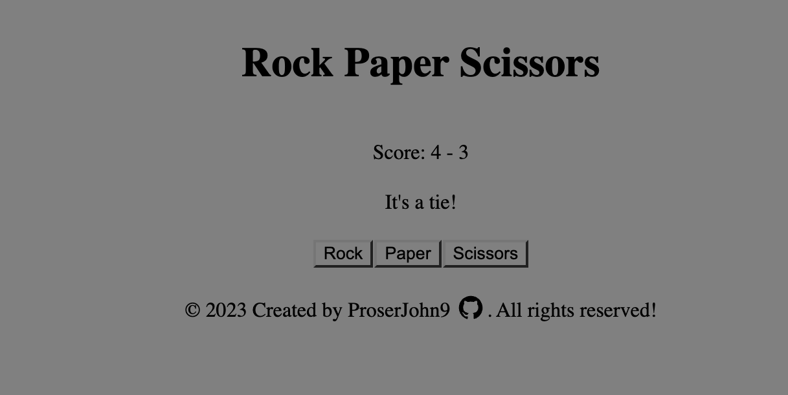

# Rock Paper Scissors
This is a simple project to learn how to use javascript. 

It's not very useful, but it does demonstrate some of the basics.

Created a game of rock, paper, scissors using html, css and js.

Live Demo:
https://prosperjohn9.github.io/rock-paper-scissors/

Desktop View:

This project was created for the Rock Paper Scissors assignment as part of The Odin Project curriculum.

# Objectives
1. Function that randomly selects computer hand.
2. Function that takes user/CPU selection and determines winner.
3. Function to run game, first to five wins.
4. Utilize click event listeners on user selections.
5. Display running score, announce winner at 5 points.
